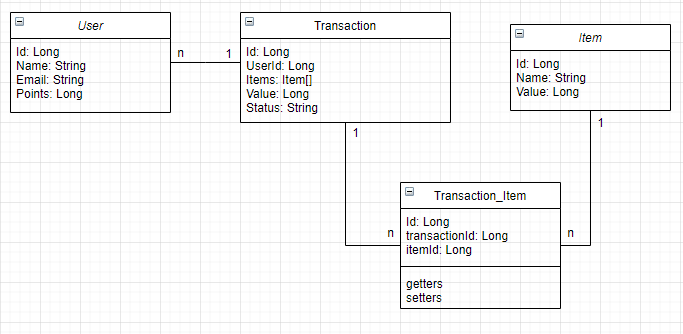

# TP Programacion con Objetos Avanzada

#### Modelo de clases


#### Modelo de datos


#### Patrones de diseño
Como patron utilicé el patron Builder para uno de los objetos, el de Transaction, ya que se reciben parte de los parametros y va armando segun los items.

#### Dependencias
* Para el mapeo de la api a nivel endpoints, utilicé el framework Spring, ya que es muy sencilla de usar, mapea servicios, controllers y demas casi automagicamente.  
* Para la conexion a la base MySQL utilicé la librería de Exposed, ya que tengo experiencia usandola en Kotlin y es bastante popular.  
* Para la configuracion de la conexión a la base, utilicé Hikari que tambien tengo experiencia e investigando vi que es de las mas usadas.  
* Para el testing usé Mockito, una libreria muy conocida tanto en Java como en Kotlin, que permite mockear tanto llamadas REST como objetos y etcétera.  
* Tambien utilicé H2 para mockear la base de datos en los tests.  


## API Reference

#### Create new user

```
  POST /api/user
```
Body
```
{
"name":  "Jason",
"email":  "test@test.com",
"points":  50
}
```
Response
```
{
"userId":  7
}
```

#### Get user by id

```
  GET /api/user/${userId}
```

| Parameter | Type     | Description                       |
| :-------- | :------- | :-------------------------------- |
| `userId`      | `long` | Id of user |

Response
```
{
"id":  5,
"name":  "Jason",
"email":  "test@test.com",
"points":  30
}
```

#### Create new item

```
  POST /api/item
```
Body
```
{
"name": "balde",
"value": 5
}
```
Response
```
{
"itemId":  7
}
```

#### Get item by id

```
  GET /api/item/${itemId}
```

| Parameter | Type     | Description                       |
| :-------- | :------- | :-------------------------------- |
| `itemId`      | `long` | Id of item|

Response
```
{
"id": 2,
"name": "balde",
"value": 5
}
```

#### Create new transaction

```
  POST /api/transaction
```
Body
```
{
"user_id": 5,
"items": [1, 1]
}
```
Response
```
{
"transactionId":  7
}
```

#### Get transaction by id

```
  GET /api/transaction/${transactionId}
```

| Parameter | Type     | Description                       |
| :-------- | :------- | :-------------------------------- |
| `transactionId`      | `long` | Id of transaction|

Response
```
{
"id": 6,
"userId": 4,
"items": [1, 1],
"value": 20,
"status": "OPEN"
}
```
